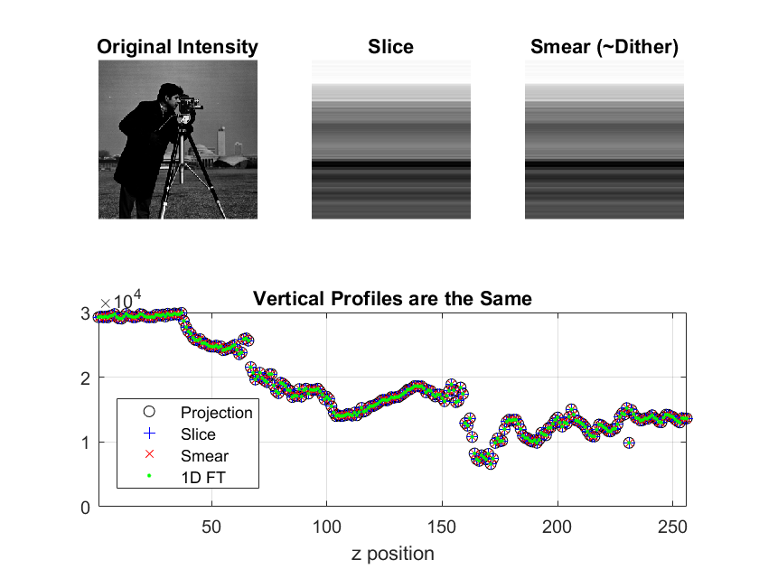
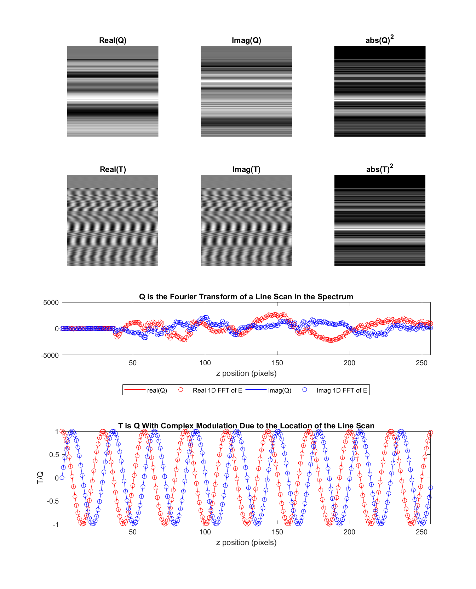
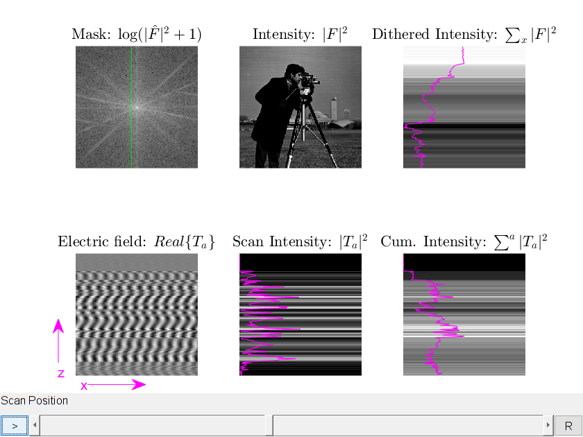
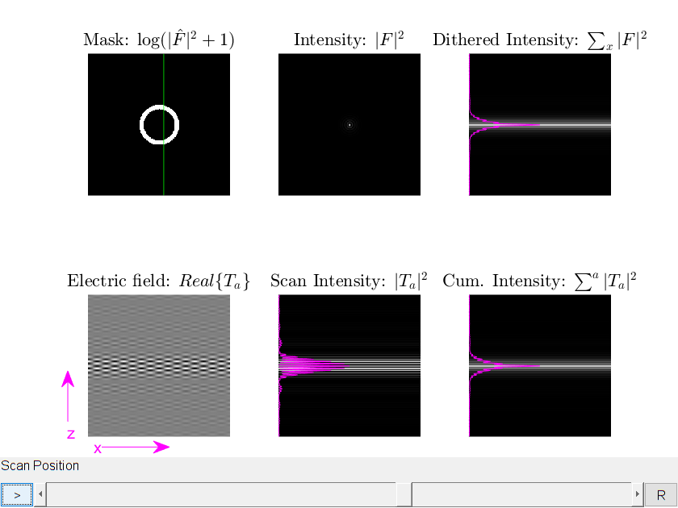
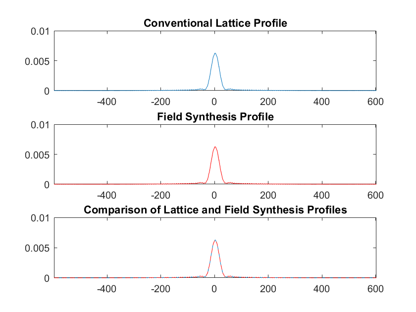
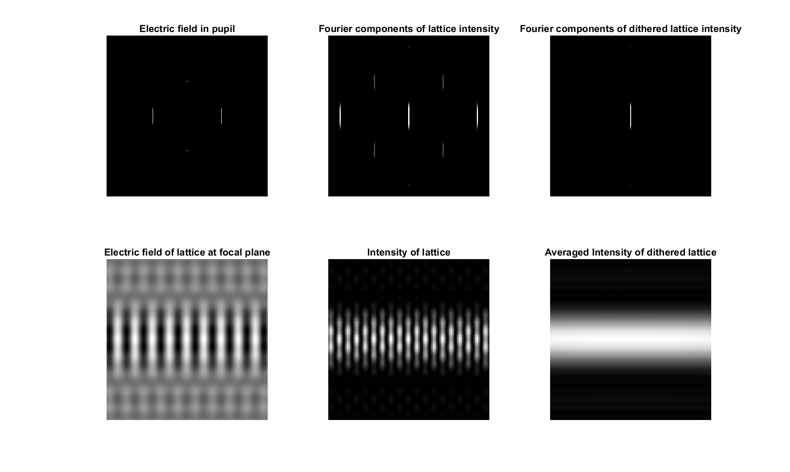
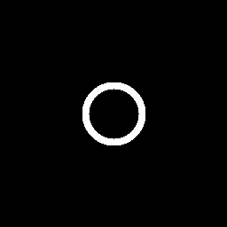
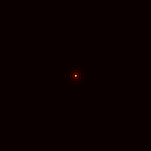

# FieldSynthesis

## Abstract

We introduce Field Synthesis, a theorem and method that can be used to synthesize any scanned or dithered light-sheet, including those used in lattice light-sheet microscopy (LLSM), from an incoherent superposition of one-dimensional intensity distributions. Compared to LLSM, this user-friendly and modular approach offers a simplified optical design, higher light-throughput and simultaneous multicolor illumination. Further, Field Synthesis achieves lower rates of photobleaching than light-sheets generated by lateral beam scanning.
## Manuscript


Bo-Jui Chang<sup>1</sup>, Mark Kittisopikul<sup>2,4</sup>, Kevin M. Dean<sup>1,3</sup>, Phillipe Roudot<sup>1,3</sup>, Erik Welf<sup>1,3</sup> and Reto Fiolka<sup>1,3</sup>.
"Universal Light-Sheet Generation with Field Synthesis."
 
### Affiliations
1. Department of Cell Biology, UT Southwestern Medical Center, Dallas, TX, USA. 
2. Department of Biophysics, UT Southwestern Medical Center, Dallas, TX, USA.
3. Lyda Hill Department of Bioinformatics, UT Southwestern Medical Center, Dallas, TX, USA.
4. Department of Cell and Molecular Biology, Feinberg School of Medicine, Northwestern University, Chicago, IL, USA.

### BioRxiv Preprint
[https://www.biorxiv.org/content/early/2018/09/26/427468](https://www.biorxiv.org/content/early/2018/09/26/427468)

## Proof

The canonical proof can be found in the supplemental information of the manuscript. Here we also have also included 
[an illustrated proof for the Field Synthesis Theorem in the form of a MATLAB Live Script](https://mkitti.github.io/FieldSynthesis/FieldSynthesis/FieldSynthesisProofIllustration.html).

A more [general Field Synthesis Theorem proof for the an arbitrary, non-ideal line profile](https://mkitti.github.io/FieldSynthesis/FieldSynthesis/FieldSynthesisProofIllustrationNonIdeal.html) is now also available.

## System Requirements

* [MATLAB (2017a or above), Mathworks, Natick, MA](https://www.mathworks.com/support/sysreq.html)
	* Image Processing Toolbox
	* Follow MATLAB link above for operating system requirements
* Git 2.18.0 or above

## Installation and Demo

Typical Install Time: 5 minutes

git clone https://github.com/AdvancedImagingUTSW/FieldSynthesis.git

See below documentation for demonstration. Typical run time: 10 minutes

## Code

### FieldSynthesisTheorem.m

   Small program to illustrate a new Field Synthesis Theorem.

   In essence it says that the projection of the absolute modulus of a
   complex field is the same as when one takes a sliding window in the
   Fourier domain, makes an inverse FFT of each slice, take the absolute
   modulus of that and sum it up while moving the window through the
   spectrum.  This has important applications for scanned light-sheets and
   how to generate them.

   Reto Fiolka, May 2017  
   Mark Kittisopikul, May 2017 - Aug 2018

   #### INPUT
   * efield - electric field at the focal plane, may be real or complex
            valued
   
   #### OUTPUT
   * efield - electric field at the focal plane
   * slice  - intensity of illumination pattern by field synthesis
   * smear  - intensity of illumination pattern by dithering
   * Q      - Fourier transform of individual line scan without phasing,a=10
   * T      - Fourier transform of individual line scan with phasing,a=10

```matlab
FieldSynthesisTheorem.m;
```





### FieldSynthesisInteractive.m

FieldSynthesisInteractive Create an interactive line scan demonstration of
field synthesis

 #### INPUT
 * mask - mask at the pupil, which is the Fourier transform of electrical
        field at the focal plane. zeroth frequency should be in the
        middle. ifftshift will be applied for calcualtions.
 * doshift - if true, shift the Fourier transform of the mask so the first
           pixel is in the center of the image rather than the upper left
 * lineProfile  -  line profile for the scan in the pupil mask
                 EITHER:
                 1) 0 for a delta function line scan
                 2) a positive double value indicating the sigma of the
                      gaussianLine in pixels
                 3) a line profile vector the same width as mask. The main
                    peak is expected to be in the center and ifftshift
                    will be applied

 #### OUTPUT
 * hfig - handle for the display figure

 #### INTERACTIVE
 * The button in the lower left plays / pauses the movie.
 * The arrow buttons on the slider will move the scan by one column.
 * Clicking on the trough of the slider will move the scan by five columns.
 * The button in the lower right labeled R will reset the cumulative view.

 #### DISPLAY
 The display consists of 6 panels
 1 2 3
 4 5 6
 1. The pupil mask, |\hat{F}|^2 in log scale
 2. The object domain, |F|^2, scanning left to right
    Line plot indicates beam intensity
 3. Dithered, averaged intensity. Cumulative sum of display #2
 4. Display of the real component of the electric field of an insteaneous
    scan, Real{T_a}
 5. Instaneous scan intensity, |T_a|^2
 6. Cumulative scan intensity of display #5

 #### EXAMPLE
```matlab
 FieldSynthesisInteractive; % default demonstration with cameraman
```


```matlab
 FieldSynthesisInteractive(createAnnulus(),true); % demonstrate a Bessel beam
```



```matlab
 %Create a sinc profile to emulate a scan over a finite range
 N = 128;
 x = -ceil(N/2):floor(N/2-1)
 L_hat = fftshift(fft(ifftshift(abs(x) < 30)));
 FieldSynthesisInteractive(createAnnulus(),true,L_hat);
```

 Mark Kittisopikul , August 2018  
 Goldman Lab  
 Northwestern University

### FieldSynthesisVersusLattice.m

Simulation for field synthesis

   compares field synthesis vs square lattice


   Reto, May 2017  
   Mark Kittisopikul, August 2018

   #### INPUT
   * n - Defines the size of the image and mask to be n x n
   * w - Width of the mask components
   * r - Radius of the annulus (width is centered on the annulus)
   * offset - Offset of the side components of the square lattice
   * dispRange - Set which part of mask to display in figures

   #### OUTPUT
   * out - struct containing workspace of this function

```matlab
FieldSynthesisVersusLattice.m
```





### createAnnulus.m

 #### INPUT (all optional)
 * n - size of the annular mask as a scalar, or vector with coordinates
 * r - radius of the annulus in pixels
 * w - width of the annulus in pixels

 #### OUTPUT
 * annulus - n x n matrix with the annulus marked with ones

 #### USAGE
```matlab
 figure;
 imshow(createAnnulus(256,32,4),[]);
```



 Create Bessel beam 2D profile
```matlab
 figure;
 imshow(log(abs(fftshift(ifft2(ifftshift(createAnnulus)))).^2+1),[]);
 colormap(gca,hot);
 caxis([0 6e-4]);
```



 #### REMARKS
 This could be streamlined using the bresenham circle algorithm

 Mark Kittisopikul, August 25th, 2018  
 Lab of Robert D. Goldman  
 Northwestern University

## License

    See LICENSE.txt

    Field Synthesis Demonstration - MATLAB code to demonstrate field synthesis light sheet microscopy
    Copyright (C) 2018 Reto Fioka, University of Texas Southwestern Medical Center
    Copyright (C) 2018 Mark Kittisopikul, Northwestern University

    This program is free software: you can redistribute it and/or modify
    it under the terms of the GNU General Public License as published by
    the Free Software Foundation, either version 3 of the License, or
    (at your option) any later version.

    This program is distributed in the hope that it will be useful,
    but WITHOUT ANY WARRANTY; without even the implied warranty of
    MERCHANTABILITY or FITNESS FOR A PARTICULAR PURPOSE.  See the
    GNU General Public License for more details.

    You should have received a copy of the GNU General Public License
    along with this program.  If not, see <https://www.gnu.org/licenses/>.
